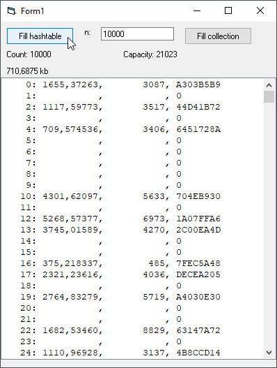

# List_Hashtable  
## The Hashtable-class from .net namesapce Collections  
  
The class mscorlib.System.Collections.HashTable translated for VB6. Project started in june 2008.  
The VBA.Collection already has hashing-capability but it is case-insensitiv, this means "a" and "A" will be the same key.
This HashTable-class is case sensitiv, so "a" and "A" will be treated as different keys.
This class is edcuational, and shows 
* what we can do with the UDTPtr- and CharPointer-methods  
* how the hashing-functions work in .net  
  
Hint: If you want to run this in your VB-IDE go to project options and set: IsNative = 0  
If you want to compile you need the following repos:  
* [Sys_Strings](https://github.com/OlimilO1402/Sys_Strings)  
* [Sys_StopWatch](https://github.com/OlimilO1402/Sys_StopWatch)  
* [Ptr_Pointers](https://github.com/OlimilO1402/Ptr_Pointers)  
  

